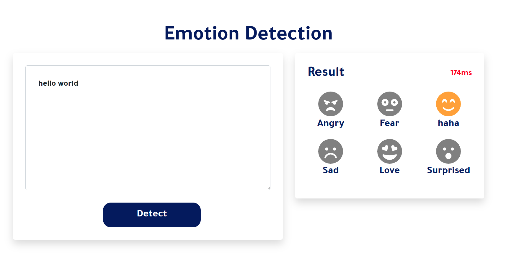

[](https://github.com/codertimo/BERT-pytorch/blob/master/LICENSE)
# Emotion Detection using BERT ##
[](https://jalammar.github.io/illustrated-bert/)

This is fine-tuning of [Google BERT model](https://github.com/google-research/bert) [[paper](https://arxiv.org/abs/1810.04805)] in Pytorch-lightning. With emotion detection task based on [Emotion HuggingFace Dataset](https://huggingface.co/datasets/emotion) , an available onnx version and docker image for the model contains flask application as a demo for the model.

> BERT 2018 BERT: Pre-training of Deep Bidirectional Transformers for Language Understanding
> Paper URL : https://arxiv.org/abs/1810.04805
<!-- Requierments -->
## Installation
- Programming language
  - `Python 3.6`

- Operating system
  - `Ubuntu 20.04.4 LTS (64 bit)` 
- Install Required packages
  - ```
    pip install -r requirements.txt
    ``` 

## Inference
### Download checkpoints
- Available Checkpoints are trained on Emotion Dataset.
|  Name  | gdrive id | Size |
|:------:|:----------:|:------------------:|
|  best-checkpoint.ckpt  |    1l5zGZyldWU-rPaWRFvdtc7Yurw7cEDZo   |     `1.2GB`      | 
|  model.onnx  |    1BnOF_ZYDq7XmY_haBfddPo7Fc46dcm0f    |     `413.3MB`      |

- You can download the model that you need by running this command 
```bash
gdown --id <gdrive id>
```

### Pytorch inference
To run inference download `best-checkpoint.ckpt` in models directory and run this command.

``` bash
python3 inference.py --sentence <Your sentence here>
```
### Onnx inference
To run inference in onnx download `model.onnx` in `models` directory and run this command.
``` bash
python3 onnx_inference.py --sentence <Your sentence here>
```
Or you can generate `model.onnx` from `best-checpoint.ckpt` by run:
```bash
python3 to_onnx.py
```
## Demo
You can run the demo app by build the docker image by 
```bash
    sudo docker build -t emotion-detection-bert .
```
and then run the image to initiate the app
```bash
    sudo docker run -p 5000:5000 emotion-detection-bert:latest
```

<p align="center">
    
</p>

<!-- insert the flask app image -->

## Training
After installing the requirements, in order to train the model update model configuration to meet your needs and simply run:

```
!python train.py
```

## Citation
```
@article{devlin2018bert,
  title={BERT: Pre-training of Deep Bidirectional Transformers for Language Understanding},
  author={Devlin, Jacob and Chang, Ming-Wei and Lee, Kenton and Toutanova, Kristina},
  journal={arXiv preprint arXiv:1810.04805},
  year={2018}
}
```